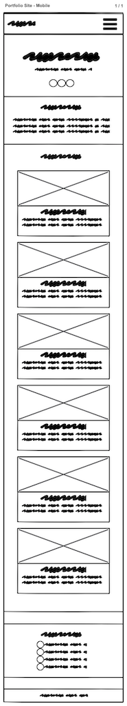

# Portfolio Site

## Site URL: https://sidharthamishra.github.io

---

## Technologies Used

- HTML
- CSS/Sass
- JS
- Markdown (Documentation)
- Bootstrap
- Google Fonts
- Ionicons
- Normalize.css
- Animate.css
- Balsamiq Cloud
- Pexels
- GitHub
- VS Code
- Chrome Dev Tools
- W3 Validator (HTML/CSS)
- JSHint
- PicResize
- Color Hunt
- Tested on: Chrome, Safari, Firefox, and Opera

---

## Initial Wireframe



_Wireframe Later Tweaked During Development_

---

## Repo Structure

```
sidharthamishra.github.io
    |
    |
    |- css
    |   |
    |   |- vendor
    |   |      |- ionicons
    |   |          |- fonts
    |   |          |    |- ionicons.eot
    |   |          |    |- ionicons.svg
    |   |          |    |- ionicons.ttf
    |   |          |    |- ionicons.woff
    |   |          |- ionicons.css
    |   |          |- LICENSE
    |   |
    |   |- styles.css
    |   |- styles.css.map
    |
    |- icons
    |   |- icon-bell.svg
    |   |- icon-dashboard.svg
    |   |- icon-facebook.svg
    |   |- icon-google-plus.svg
    |   |- icon-members.svg
    |   |- icon-settings.svg
    |   |- icon-twitter.svg
    |   |- icon-visits.svg
    |
    |- img
    |   |- employee_directory.png
    |   |- game_show_app.png
    |   |- hero_img_lg.jpg
    |   |- interactive_photo_gallery.jpg
    |   |- memory_game.jpg
    |   |- online_registration_form.jpg
    |   |- web_app_dashboard.jpg
    |   |- white_emblem.png
    |   |- white_logo.png
    |
    |
    |- js
    |   |- app.js
    |
    |- scss
    |   |- base
    |   |   |- _base.scss
    |   |   |- _index.scss
    |   |   |- _normalize.scss
    |   |   |- _typography.scss
    |   |
    |   |- componenets
    |   |   |- _footer.scss
    |   |   |- _hero.scss
    |   |   |- _index.scss
    |   |   |- _media-element.scss
    |   |   |- _modal.scss
    |   |   |- _nav.scss
    |   |   |- _project-card.scss
    |   |   |- _scroll-top.scss
    |   |
    |   |- utilities
    |   |   |- _index.scss
    |   |   |- _mixins.scss
    |   |   |- _variables.scss
    |   |
    |   |
    |   |- styles.scss
    |
    |- index.html
    |
    |- README.md

```

---
